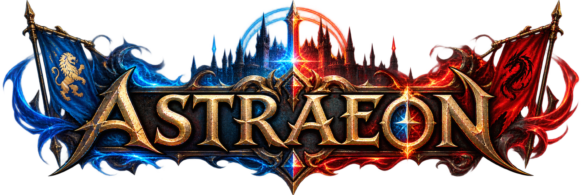
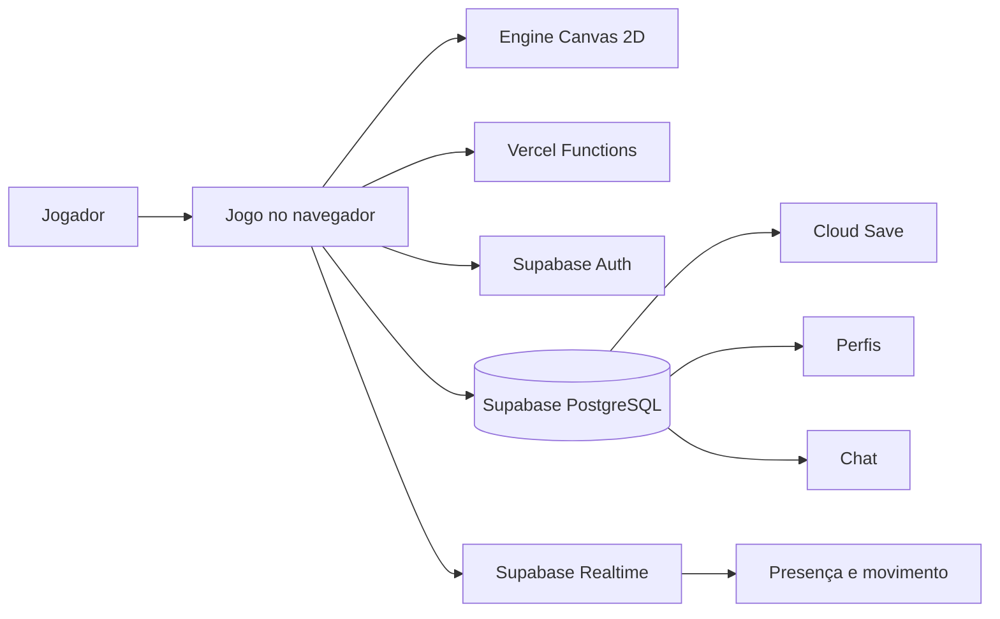

<div align="center">



## ASTRAEON ONLINE

### ECOS DA CONVERGÊNCIA

**Um RPG 2D online onde cinco climas disputam o mesmo mundo — e cada viajante escreve a própria lenda.**

[](package.json)
[](#estado-do-projeto)
[](#tecnologia)
[](#arquitetura-online)
[](LICENSE)
[](COPYRIGHT.md)

`EXPLORAR` · `EVOLUIR` · `EQUIPAR` · `CONECTAR`

</div>

---

> [!IMPORTANT]
> **AVISO DE DIREITOS AUTORAIS**
> Copyright © 2026 **Erick Israel (eiisrael)**. A publicação deste repositório não coloca o projeto em domínio público. O código-fonte e a documentação originais são disponibilizados sob a [MIT License](LICENSE), que exige a preservação do aviso de copyright e do texto da licença. O nome **Astraeon**, sua identidade visual, universo narrativo e elementos autorais originais não recebem automaticamente uma licença de marca por meio da licença do software. Assets de terceiros continuam sujeitos aos direitos e licenças de seus respectivos titulares. Leia [Direitos autorais e uso](#direitos-autorais-e-uso) e [`COPYRIGHT.md`](COPYRIGHT.md) antes de redistribuir o projeto.

---

## Entre na Convergência

**Astraeon Online** é um RPG 2D executado diretamente no navegador. Sua engine própria combina **JavaScript**, **HTML**, **CSS** e **Canvas 2D** para construir um continente procedural com combate, classes, equipamentos, cidades, NPCs e progressão.

A camada online usa **Supabase** para autenticação, saves e presença multiplayer, enquanto a aplicação e suas funções web podem ser publicadas na **Vercel**.

> *Astra foi fragmentada. Florestas antigas, desertos solares, terras glaciais, pântanos sombrios e montanhas vulcânicas agora coexistem no mesmo continente. No centro da ruptura, a Convergência aguarda novos viajantes.*

### O que já existe no jogo

| Sistema | Experiência |
|---|---|
| 🌍 **Mundo procedural** | Continente de 96 × 96 tiles, cinco biomas, clima e ciclo visual |
| ⚔️ **Combate responsivo** | Ataques, habilidades, crítico, mana, fôlego, efeitos direcionais e zoom suave |
| 🧬 **Progressão** | Níveis, pontos de características e evolução de atributos |
| ✦ **Domínios de habilidades** | Dois domínios e 20 poderes por classe, compra persistente e loadout de cinco slots |
| 🎒 **Inventário** | Equipamentos, raridades, slots padronizados, mochila e drag-and-drop |
| 🏙️ **Mundo vivo** | Cidades, áreas seguras, comerciantes e NPCs contextuais |
| 👥 **Online social** | Conta, save em nuvem, presença, movimento remoto e chat mundial |
| 🛠️ **Admin Studio** | Editores de mundo, painéis, contas, personagens, mobs, itens e balanceamento |
| 📱 **Multiplataforma** | Interface e controles adaptados para desktop e mobile |

---

## Classes jogáveis

| Classe | Arquétipo | Especialidade |
|---|---|---|
| 🛡️ **Guerreiro** | Linha de frente | resistência, impacto e armas pesadas |
| 🔮 **Mago** | Conjurador | mana, controle de área e dano mágico |
| 🏹 **Arqueiro** | Combatente à distância | precisão, mobilidade e alcance |
| 🗡️ **Assassino** | Executor | velocidade, crítico e reposicionamento |
| ✨ **Paladino** | Guardião | defesa, cura e poder sagrado |

Itens incompatíveis podem ser encontrados e guardados, mas somente classes compatíveis conseguem equipá-los.

---

## Controles

| Ação | Desktop |
|---|---|
| Mover | `WASD` ou setas |
| Correr | `Shift` |
| Ataque básico | Clique esquerdo ou `Espaço` |
| Rotação automática de habilidades | Segurar clique direito |
| Habilidades | `1` a `5` |
| Domínios de habilidade | `H` |
| Inventário | `I` |
| Características | `C` |
| Mapa | `M` |
| Chat | `Enter` |
| Mestre de Habilidades | Segurar `E` ou clicar no NPC |
| Ajuda | botão `?` |
| Pausar | `Esc` |
| Zoom | Scroll do mouse ou gesto de pinça |

No mobile, controles touch oferecem movimentação, corrida, ataque, habilidades, interação e zoom por pinça.

---

## Terras de Astra

- 🌲 **Bosque de Lúmen** — árvores monumentais e clareiras luminescentes;
- ☀️ **Ermos de Solvar** — planícies, ravinas e pedras queimadas;
- ❄️ **Véu de Nivora** — lagos congelados e formações cristalinas;
- 🌑 **Pântano de Umbria** — água rasa, névoa e ruínas esquecidas;
- 🌋 **Altos de Cinza** — escarpas, fissuras vulcânicas e fortalezas antigas.

Entre essas regiões encontram-se cidades como **Astralum**, **Lúmenfall**, **Solvaris**, **Nivora**, **Umbra Vale** e **Cinzalta**.

---

## Tecnologia

O núcleo foi construído sem um framework pesado de frontend. A lógica principal permanece visível e acessível no repositório.

```text
Canvas 2D       renderização do mundo, personagens, mobs e efeitos
JavaScript      engine, gameplay, inventário, multiplayer e editores
HTML + CSS      interface, HUD, painéis e Admin Studio
Supabase        Auth, PostgreSQL, RLS, Realtime e persistência
Vercel          hospedagem, headers de segurança e funções web
GitHub Actions  validação contínua
```

### Arquitetura online



O cliente sincroniza recursos sociais e persistentes. Combate, mobs, loot e economia ainda não possuem autoridade central completa; para um MMORPG competitivo, esses sistemas deverão migrar para um servidor autoritativo.

O Admin Studio exige MFA/TOTP (AAL2) e a emissão autoritativa de XP/drops possui um gateway privado para servidor de jogo. Veja [SECURITY.md](SECURITY.md) e [ONLINE_SETUP.md](ONLINE_SETUP.md) antes de configurar produção.

---

## Executar localmente

### Requisitos

- Git;
- Node.js **22.x**;
- navegador moderno;
- Vercel CLI para reproduzir as funções locais;
- projeto Supabase para habilitar os recursos online.

```bash
git clone https://github.com/eiisrael/Astraeon.git
cd Astraeon
npm run validate
npx vercel link
npx vercel dev
```

Abra o endereço fornecido pelo Vercel CLI.

### Configuração pública do modo online

```env
SUPABASE_URL=https://SEU-PROJETO.supabase.co
SUPABASE_PUBLISHABLE_KEY=sb_publishable_EXEMPLO
ASTRAEON_REALTIME_TOPIC=world:astraeon:main
```

Configure valores reais no ambiente da Vercel. **Nunca publique** `.env` real, `service_role`, `sb_secret_...`, token privado, senha ou credencial pessoal.

Guias completos:

- [`INSTALLME.md`](INSTALLME.md) — instalação, banco e deploy;
- [`ONLINE_SETUP.md`](ONLINE_SETUP.md) — arquitetura e configuração online;
- [`SECURITY.md`](SECURITY.md) — práticas e política de segurança.

---

## Admin Studio

O **Admin Studio 6.4** concentra os recursos de produção e administração em uma interface separada.

```text
Desenvolvimento: http://localhost:3000/game-editor
Produção:        https://SEU-DOMINIO/game-editor
Atalho ingame:  F10
```

Principais áreas:

- editor visual de painéis e camadas;
- editor de mapas, biomas, cidades e locais;
- contas e personagens;
- mobs, drops e itens;
- mensagens de sistema;
- balanceamento de classes e gameplay;
- importação, exportação, autosave e backup.

> [!WARNING]
> Ocultar uma rota ou usar `noindex` não substitui autenticação. Ferramentas administrativas de produção devem permanecer protegidas por sessão, autorização e roles no backend.

---

## Segurança e validação

O projeto inclui verificações de sintaxe, integridade estrutural, contratos de gameplay, referências obrigatórias e possíveis segredos rastreados.

```bash
npm run validate
```

Entre as proteções existentes:

- Row Level Security para dados de jogadores;
- ownership imutável de saves por personagem;
- perfis internos isolados e identidade pública resolvida por RPC mínima;
- MFA/AAL2 nas mutações administrativas;
- Realtime social vinculado ao `auth.uid()` no banco;
- configuração pública separada de segredos administrativos;
- CSP, HSTS, `nosniff` e proteção contra framing;
- Supabase JS versionado e servido localmente, sem CDN em runtime;
- texto do chat tratado sem interpretação de HTML;
- validação automatizada de arquivos e módulos;
- testes de características, câmera, dano direcional e renderização de assets.

---

## Estrutura do projeto

```text
Astraeon/
├── index.html                     # cliente público do jogo
├── game-editor.html               # Admin Studio
├── api/                            # funções web e controle administrativo
├── Assets/
│   ├── Classes/                    # retratos das classes
│   ├── Mob/                        # retratos das criaturas
│   └── img/                        # logos, habilidades e trilhas de áudio
├── src/
│   ├── game-v2.js                 # engine principal
│   ├── world-v2.js                # mundo procedural
│   ├── inventory-v*.js            # inventário e equipamentos
│   ├── characteristics-v1.js      # distribuição de atributos
│   ├── multiplayer-v4.js          # presença e persistência online
│   ├── chat-system-v4.js          # Chat de Astra
│   ├── panel-studio-*.js           # runtime dos painéis
│   └── admin-*.js                  # módulos administrativos
├── supabase/migrations/            # schema, RLS e recursos online
├── scripts/                        # validações automatizadas
├── COPYRIGHT.md                    # titularidade e escopo autoral
├── LICENSE                         # licença MIT do software
└── SECURITY.md                     # política de segurança
```

---

## Estado do projeto

### Implementado

- [x] mundo procedural e cinco regiões;
- [x] cinco classes, dez domínios e cem habilidades persistentes;
- [x] combate, características e progressão;
- [x] inventário, equipamento e drag-and-drop;
- [x] cidades e NPCs;
- [x] conta, cloud save e presença multiplayer;
- [x] chat mundial e mensagens próximas;
- [x] interface desktop/mobile;
- [x] Admin Studio e Editor de Painéis;
- [x] validação automatizada.

### Próximas fronteiras

- [ ] autoridade central para mobs e combate;
- [ ] loot e economia compartilhados;
- [ ] party, guildas e comércio;
- [ ] PvP com regras de segurança;
- [ ] testes E2E com múltiplos clientes;
- [ ] expansão narrativa e novas regiões.

---

## Direitos autorais e uso

### Titularidade

Copyright © 2026 **Erick Israel (eiisrael)**.

O autor mantém o copyright sobre o código, a documentação e os elementos originais criados para **Astraeon Online**, exceto quando um arquivo ou componente identificar titularidade diferente.

### Código e documentação — MIT License

A [MIT License](LICENSE) permite usar, copiar, modificar, mesclar, publicar, distribuir, sublicenciar e vender cópias do Software. Para exercer essas permissões, o aviso de copyright e o texto integral da licença devem acompanhar todas as cópias ou partes substanciais.

| Você pode | Você deve |
|---|---|
| usar e modificar o software | preservar o aviso de copyright |
| distribuir cópias e versões derivadas | incluir o texto da MIT License |
| publicar ou comercializar o software | respeitar direitos de materiais de terceiros |

A licença fornece o software **“como está”**, sem garantia, conforme detalhado em [`LICENSE`](LICENSE).

### Nome, universo e identidade visual

A licença do software não deve ser interpretada como concessão automática de direitos de marca sobre o nome **Astraeon**, seus logotipos, identidade visual ou apresentação comercial. A narrativa e os elementos criativos originais continuam associados ao projeto e ao seu autor, nos limites da legislação aplicável.

### Imagens, músicas, fontes e outros materiais

Imagens, sprites, músicas, efeitos sonoros, fontes, bibliotecas e outros materiais que possuam autoria ou licença própria permanecem sujeitos aos direitos dos respectivos titulares. A presença de um arquivo no repositório não elimina esses direitos nem autoriza presumir que ele esteja em domínio público.

Antes de reutilizar ou redistribuir assets, confirme sua origem e licença aplicável. Este projeto não reivindica autoria sobre materiais de terceiros.

### Referências legais

- [`COPYRIGHT.md`](COPYRIGHT.md) — aviso autoral completo;
- [`LICENSE`](LICENSE) — termos da MIT License;
- [`SECURITY.md`](SECURITY.md) — política de segurança.

> Este resumo facilita a leitura, mas não substitui os textos integrais de `LICENSE` e `COPYRIGHT.md`.

---

<div align="center">

## ✦ ASTRAEON

**A Convergência abriu o caminho. Agora atravesse.**

Feito com código, mundo procedural e ambição por **Erick Israel**.

Copyright © 2026 · Todos os avisos legais devem ser preservados.

</div>
